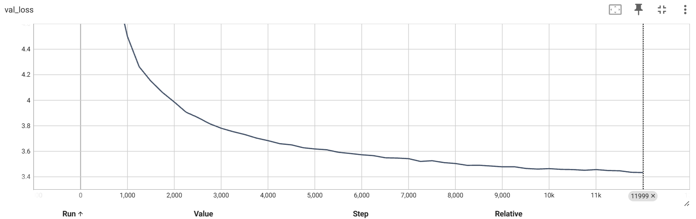
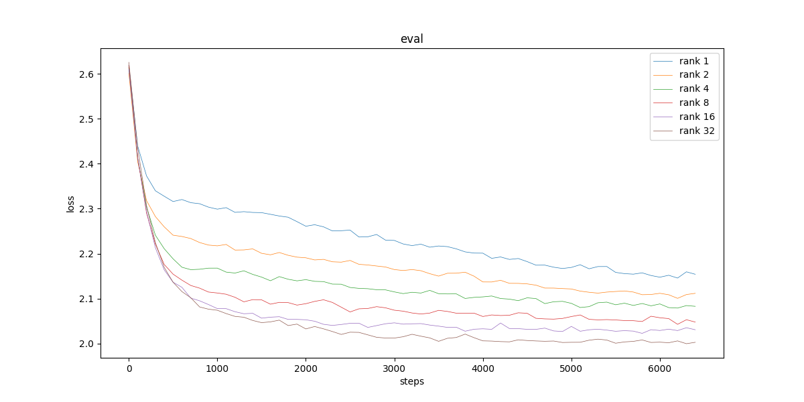

## Task1: Tokenization 

BPE(Byte Pair Encode, 字节对编码)是一种用于文本分词的方法。它通过合并高频字符或子词的组合，逐步减少文本的分粒度。其从单个字符开始，逐渐合并为子词，最终形成一个高效的词汇表。

具体来说，BPE算法主要接收两个参数, 训练语料文本和词汇表大小。   
BPE中，文本通常通过字节编码，这样直接对 0到255 的整数序列进行操作。

BPE依赖一个较大的语料集进行训练。训练大致流程为不断迭代扩充词汇表到指定大小。
每次迭代中，统计文本中所有相邻的 token pair 数， 选择 **出现次数最多的 token pair** (这里的token可以是初始的 0-255, 也可以是新生成的)，将文本中所有这样的pair替换为新的token。

编码具体字符串时，每次找到串中一种相邻pair，使得其 **替换后的新 token id 最小**（即出现频率最高），并将其替换。迭代直至无法合并。
（比较容易证明，新合成的token id中，id越小说明在语料中的频率越高。outfile中的输出结果也可以印证这点。）

解码具体token序列时，BPE将每个token对应的字符串拼接即可。

#### 基于BPE算法训练LLM tokenizer的流程

收集语料：收集一个庞大的文本数据集，作为tokenizer训练的基础数据源。该数据集应覆盖模型预期的应用领域。

设置合并步数：预设词汇表大小，例如10,000次或更大。较大的词汇表通常能更好地处理开放词汇，但可能增加模型复杂度。

执行 BPE 训练：对收集的文本数据运行 BPE 算法，逐步合并高频字符对并构建词汇表。训练过程会生成一系列规则，描述哪些字符或分词应该合并。需要注意，LLM tokenizer训练通常采用字节编码。

生成tokenizer：将最终生成的词汇表和合并规则保存下来，作为tokenizer。tokenizer可将任意输入文本分割成已学习的分词单元，从而适应模型的输入格式。

使用tokenizer编码数据：将原始语料数据通过训练好的tokenizer进行编码，编码为 interger list 类数据结构(numpy.array, torch.tensor)保存。这其实是对输入数据处理的第一步。


#### 算法实现

代码概况：
```
bpe/
│
├── base.py  # 一些简单的工具函数和Tokenizer基础类定义
├── basic.py # 完整BPE算法的tokenizer实现。包含 BasicTokenizer 与 MyTokenizer 类
├── run.py # 加载训练语料与测试相关代码
```

首先参考 https://github.com/karpathy/minbpe, 实现了基础的tokenizer. 见 BasicTokenizer方法。

#### plus: BPE算法复杂度改进
但本人发现该算法朴素实现耗时较久。
分析训练过程时间复杂度：记语料大小为 $n$, 本例中 manual.txt 语料转换为字节后长度为 1.74e5.    $vocab\_size = m$，本例中 $ m = 1024 $。
核心复杂度相关代码为：

```py
for i in range(num_merges):
    stats = get_stats(ids)
    pair = max(stats, key=stats.get)
    ids = merge(ids, pair, idx)
```
循环 $m$ 次。每次循环要遍历整个文本做统计 $O(n)$ , 找到最大值 $O(n)$, merge $O(n)$.
总时间复杂度 $O(n*m)$, 空间复杂度 $O(n)$.

发现很多信息一直再被重复计算。且寻找最值的过程不一定需要 $O(n)$ 遍历。
**我通过精细实现，将训练过程的时间复杂度优化到 $O(nlog(n))$**。
核心思路：使用双向链表快速合并，且只需在合并时维护pair的统计信息。用堆（优先队列）维护最值信息。
链表最多合并 $n-1$ 次，每次可以 O(1) 合并。 向优先队列中添加的总元素为 $O(n)$。则总复杂度 $O(nlog(n))$.
具体代码见 MyTokenizer 与 LinkedListText 类。

优化实现通过校验，与朴素实现结果一致，正确。
优化前后前后训练时间对比为 **$ 66.56s \to 2.76s $**. 效果在该实验下十分显著。

encode过程也可以类似修改。但通常需要encode的文本较短，没有必要。

#### 用它来encode再decode manual.txt，检查与原始manual.txt是否完全一致？ 
encode 与 decode 后的结果与原文本完全一致，run中通过assert得以验证。

#### 学习使用huggingface transformers中的tokenizer，使用它加载GPT-2的tokenizer，然后使用它和你训练的tokenizer分别encode以下句子，比较两者的输出，简要解释长度上和具体token上不同的原因是什么。

具体token结果过长不予展示，放在bpe/outfile/encode_res.out。
长度如下表：

|   | 英文长度 | 中文长度 |
|  ----  | ----  | --- |
| 原文本byte长度 | 965 | 447 |
| BPEtokenizer | 937 | 118 |
| GPT2tokenizer  | 185 | 306 |

本BPE模型基于中文语料，对中文语料的高频信息能够很好的提取，合并得到的结果短了4倍。而在英文语料上几乎无分词能力。
GPT2训练主要基于英文语料, 英文语料上的效果接近 5.33 byte/token. 但中文语料效果一般。

具体内容上：
本BPE模型得到的英文结果中，token_id 几乎全在 0-255之间, 这是因为直接表示了单个字符，几乎没有单词、词根的提取。
GPT2中，英文结果的 token_id 普遍比中文结果 token_id 小，说明英文token在训练语料中出现频率较高，符合预期。

#### Answer 1.2: 

一、Python中使用什么函数查看字符的Unicode，什么函数将Unicode转换成字符？并使用它们查看“北”“大”的Unicode，查看Unicode为22823、27169、22411对应的字符。
ord(char) -> unicode, chr(unicode) -> char. 
"北大" unicode分别为 21271, 22823。 [22823、27169、22411] 对应 '大模型'。

二、Tokenizer的vocab size大和小分别有什么好处和坏处？
大 vocab_size：优势有表达能力强、减少模型遇到未知词汇的情况。缺点有稀疏性、计算复杂度高 （正如之前分析的，和 vocab_size 成正比）。
小 vocab_size 基本将 大 vocab_size 的优缺点反过来即可。、

三、为什么 LLM 不能处理非常简单的字符串操作任务，比如反转字符串？
因为LLM 首先将字符串做tokenization, 反转的对象通常是经过分词后的token序列。而原串中的一个字符可能对应多个token，因此难以学习到原序列上进行的操作。
此外，LLM本质是generate next token. 而像反转字符串这样的操作，当前输出只由原串对应位置决定，与之前几个位置的字符几乎无关联。这样会导致学习效率的低下，难以充分利用学习性能。

四、为什么 LLM 在非英语语言（例如日语）上表现较差？
正如之前对比BPE、GPT2的中英文分词结果所示，分词的训练语料中，可能英文占据主导地位。训练后的分词器对英文单词、词根的tokenize效果更好。此外，不同语言的语法和文字系统可能有较大差异，如日语使用三种文字（汉字、平假名、片假名），训练难度高。

五、为什么 LLM 在简单算术问题上表现不好？
LLM的训练通常不专注于数学计算和推理能力。以简单的加法为例，LLM正向的generate next token使之很难拟合人类的竖式加法方式，又很难像加法器一样机械按位操作得到结果。模型还可能会受到上下文的影响，轻微的干扰便可能影响其结果。此外，算术问题可以有多种表达方式，分词后的问题不一定能被模型正确理解。

六、为什么 GPT-2 在编写 Python 代码时遇到比预期更多的困难？
代码生成的要求比较苛刻，错误容忍度极低，其不是简单的文本生成，包含逻辑推理与算法。
同时，python代码包含较多空格，GPT2无法很好的处理，使得文本序列变得冗长，降低了模型的有效上下文处理长度。

七、为什么 LLM 遇到字符串 “<|endoftext|>” 时会突然中断？
<|endoftext|> 被用作文本结束标记，表示文本序列的终止。LLM允许用户通过该提示符结束逻辑片段。

八、为什么当问 LLM 关于 “SolidGoldMagikarp” 的问题时 LLM 会崩溃？
分词的训练数据中包含了大量的 reddit 数据，可能出现了同名用户，文本中大量包含该字符串使得该串由单独的token。然而LLM的训练数据中从未出现过该 token，使得产生未定义行为。

九、为什么在使用 LLM 时应该更倾向于使用 YAML 而不是 JSON？
在同样信息文本的分词结果中，json的token更多，因此yaml的tokenization更加高效。这样的话，训练效果和经济效益更好。

十、为什么 LLM 实际上不是端到端的语言建模？
LLM需要tokenization这一步，并不是严格的直接接收输入文本产生输出。


## Task2: GPT2 Implementation

pretraining GPT2.
github 仓库地址：https://github.com/geruome/bulid_gpt2

commit 记录截图：


- commit 说明
    - initial commit, add GPT skeleton. 
    添加 GPT 框架代码 model.py. 添加 MLP、CausalSelfAttention、Block、GPT类，并实现GPT的forward函数。 play.ipynb 中做了简单测试。
    - add from_pretrained and test_model.
    为 GPT类添加 from_pretrained **类方法**，不需要提前实例化。其中拷贝参数时，要注意：
        - 无需拷贝 attention 中作为临时变量储存的 bias.
        - 一些weight参数的形状与released model中的形状不同，需要转置。
    - add dataloader and init_weights
    实现dataloader, 从很小的Shakespeare数据集加载token. 
    实现 GPT2 的参数初始化函数 init_weights, 参照GPT2 paper设置std=0.02(除了bias). 此外由于残差连接的存在，为了使所有层方差加起来稳定，每一步的 $std \div= sqrt(2*n\_layer)$, $2*n\_layer$为残差连接数。
    此外为GPT forward function添加了target和loss. 并测试了随机情况下, loss 接近于 $-ln(1/vocab_size) \approx 11$.
    - add training procedure and speedup tricks.
    训练流程包含在train_model函数中。learing_rate 调整策略在get_lr函数中，预热 + cosine decay. 优化器为AdamW, 参数参照GPT3 paper. 
    值得注意的是，为了防止梯度爆炸，使用 clip_grad_norm_ 将梯度的L2范数 clip到1.
    加速技巧包括：forward时用BF16; FP32 -> TF32; torch.compile
    - add weight_decay for Adam and function configure_optimizers
    想要为AdamW优化器加 weight_decay 参数。然而一些**一维参数**如 bias,layernorm不计入更好。
    因此需要为 GPT 添加 configure_optimizers 函数，返回对GPT参数筛选后的AdamW优化器。
    - add grad_accumulate training
    原paper有固定的batch_size 0.5M，但我的GPU不够支持如此大的batch_size, 因此需要分步累积梯度做一次backward.
    具体来说，每个step中循环grad_accum_steps次来凑够batch_size. 注意loss要除掉grad_accum_steps.
    - add DDP settings
    添加支持分布式并行计算的代码。
    每块GPU上运行一个subprocess, 唯一的标识符是 os.environ['RANK']. 
    需要调整很多处细节：
        - 重新计算 grad_accum_steps, tokens_processed等。
        - 包装：model = DistributedDataParallel(model). 并提取 raw_model 用于优化器生成等。
        - 选0号GPU的进程为主进程，只在主进程进行一些logging、validation操作。
        - loss backward时，只需要在最后一个micro_step在GPU间share. 还要用dist.all_reduce, 将累加起来的loss除以GPU数。
    启动命令不再是 python **.py, 而是 torchrun --standalone -nproc_per_node **.py
    - add fineweb dataset and validation
    从huggingface下载fineweb_edu数据集。实际操作中我没有下载10B版本，下载的1B级别。
    链接 'beomi/fineweb-edu-fortified-mini'.
    预处理为numpy文件保存供Dataloader加载。
    添加了validation相关代码。validation此时包含：在验证集测试loss、输出"Hello, I'm a language model,"的补全结果(generate_sequence函数)。
    - runable training codes
    该版代码已经可以运行并实现完整训练流程。
    - add hellaswag validation and plot_loss
    hellaswag.py 用于收集 hellaswag 测试数据。
    model.py 中添加了用于 hellaswag 测试的相关代码。
    由于我简单训练的GPT没有 instruction following 能力, 需要手动实现多选题测试。具体来说选补全句子方法中 average_loss 最小的。
    plot_train_val_loss.py 读取 tensorboard 相关文件并在一张图展现train_loss和val_loss结果。


项目结构：
```
pretrain/
│
├── model.py # 主要的模型文件, 包含模型架构、训练与验证代码
├── fineweb.py # 处理 fineweb1B数据集。
├── hellaswag.py # 处理 hellaswag 验证数据集并提供验证接口。
├── plot_train_val_loss.py # 读取 tensorboard 相关文件, 在一张图生成train、val loss曲线。
├── log/
│   ├── states/
│   │   └── **.pt # 保存的模型权重
│   └── log.txt # 日志文件，记录训练和验证的loss、指标，以及生成的句子示例。
└── edu_fineweb1B/
    └── edufineweb_{train/val}_**.npy # numpy文件,存放用于训练的token.
```

实验：
算力有限，我只在单张 RTX 4090 上训练了一轮 0.8B token, 耗时 4hour. 
结果如下：




train 与 val loss 放在一张图中：


可以看到在单轮训练的情况下，训练数据未重用，而val_loss的降低速度比train_loss较慢。
可能是数据质量问题导致，或只是训练样本太少。
可以看到 Hellaswag 验证集质量确实不错。
eval_acc 比较平滑，很简单的模型随训练深入,acc也可以得到提升；
也能在模型性能很差(图中的整个流程都在这个阶段)时提供早期的信号。
```
some sentences results:

-----------------
val_loss = 5.4825 时
Hello, I'm a language model, and reading, for which you must have been able to use. However, you can ask the most adults need
Hello, I'm a language model, which the different types of the sound. The best uses a game called the brain of that the brain to the
Hello, I'm a language model, where the most important words the same as their meaning it is in the words I'll try to us the first
Hello, I'm a language model, the most common people may look at the course. This helps you’s how many times this new students
Hello, I'm a language model, I and then use the different level of communication, and you will learn to understand how to the world.
-----------------
val_loss = 3.4449 时
Hello, I'm a language model, I'm doing a text version, but I need to get it written after the font. The script is written
Hello, I'm a language model, this is a complex text. To understand, we need to analyze the meaning of the text. What are the
Hello, I'm a language model, but it looks different and I think we are learning this and the others we'll go. Well, those are
Hello, I'm a language model, the thing I've done is, the thing I've done is, the thing I have to do to my
Hello, I'm a language model, and I'm thinking about the code. "My plans are to take that class and model it," he said
-----------------
```


## Task3: LoRA Fine-tuning

train.sh 中关键参数说明：
data_path：use_lora, True表示使用lora, false不使用
lora_dim: rank r.
data_path: ./data/alpaca_data.json. 下载好的 Alpaca 指令微调数据集, 涵盖一系列现实任务. token数大约 5e4.
train_batch_size: 修改为 default = 16
epochs: 修改为 default = 8

#### 直接使用train.sh运行现有代码，进行全参数微调，并使用generate.sh生成回复。

全参数微调时, use_lora 设为 False. 
运行 ./train.sh, 最后 train_loss 和 eval_loss 曲线如下：

(此时epoch为4)
可以看到在4个epoch之内, train_loss几乎没有下降. train_loss只是在epoch间下降。
这说明 full-size fine-tune 严重过拟合。这与微调用的alpaca数据集过小有关。
eval_loss 更是在开始之后几乎没有下降，再次说明过拟合。

./generate.sh 需要修改参数：
use_lora, lora_dim, lora_scaling等要与 train.sh一致。
全参数时, 加载本地模型, model_name_or_path 提供到 folder. transformers.AutoModelForCausalLM.from_pretrained() 会识别 folder 下的 model.safetensor 等加载本地预训练好的模型。
lora时, model_name_or_path 还是 gpt2, lora_load_path 改为 result_folder/lora.pt 

对话生成结果：

分析见之后。

#### 把lora.py里面的TODO都补充完整，并在实验报告中讲解你的实现。

```py
class LoRALinear(torch.nn.Module):
    def __init__(self, weight, bias, lora_dim, lora_scaling): # lora_dim: r
        super(LoRALinear, self).__init__()
        # Save original weight and bias
        self.weight = torch.nn.Parameter(weight)
        self.bias = torch.nn.Parameter(bias)
        # TODO: Implement lora left and right weights
        out_features, in_features = weight.shape
        self.lora_right_weight = torch.nn.Parameter(torch.zeros((in_features, lora_dim))) # matrix A
        self.lora_left_weight = torch.nn.Parameter(torch.zeros((lora_dim, out_features))) # matrix B
        self.lora_scaling = lora_scaling / lora_dim
        self.init_parameters()
        self.weight.requires_grad = False
        self.bias.requires_grad = False

    def init_parameters(self):
        nn.init.kaiming_uniform_(self.lora_right_weight, a=math.sqrt(5))
        # nn.init.normal_(self.lora_right_weight, std=0.01)

    def forward(self, input): # (16, 139, 768)
        res = F.linear(input, self.weight, bias=self.bias)
        lora_term = (input @ self.lora_right_weight) @ self.lora_left_weight * self.lora_scaling
        res += lora_term
        return res

def only_optimize_lora_parameters(model):
    for name, param in model.named_parameters():
        param.requires_grad = "lora_right_weight" in name or "lora_left_weight" in name
    return model

def get_lora_state_dict(model):
    # TODO: return lora left and right weights as state dict
    lora_state_dict = {}
    for name, param in model.named_parameters():
        if "lora_right_weight" in name or "lora_left_weight" in name:
            lora_state_dict[name] = param.data.clone()
    return lora_state_dict
```

参考 [peft](https://github.com/huggingface/peft) 库的源码实现。

所有 linear 层 forward 改为 $ W_0x + BAx $  
$W_0$为原 linear 层权重。
lora_right_weight：matrix A, shape=(in, rank). 采用Kaiming初始化, 控制每一层输入和输出的方差一致。
lora_left_weight: matrix B, shape=(rank, out). 初始化为全0. 这样保证在训练刚开始时，输出和预训练模型相同。
lora_scaling: 参考原论文公式 , 为 $\frac{lora\_scaling}{rank}$

forward中, $B*A*X$计算时，注意是 $B*(Ax)$的计算方式。
分析：计 x.shape = $B,T,in$
$ O((BA)x) = in \times out \times r+BT \times in \times out = in \times out \times BT, BT>>r$ 
$ O(B(Ax)) = BT \times in \times r+BT \times out \times r = (in+out) \times r \times BT$
GPT2-124M 中, transformer中 (in,out) 约为 $(768, 768*(3 || 4))$ 级别. 则 $B(Ax)$ 计算复杂度低。

only_optimize_lora_parameters中, 只将 A,B 矩阵的 requires_grad 设置为 True, 其余参数冻结。

get_lora_state_dict中, 保存 A,B 矩阵参数即可。

#### 使用train.sh进行LoRA微调，并使用generate.sh生成回复。测试LoRA rank为1，2，4，8，16，32时的效果，在实验报告中讨论。实现自己的画图函数，在一张图中展现不同rank的结果。

注：train_loss、eval_loss曲线采用了平滑处理。
画图相关代码见 multi_plot.py.

一张图展现**不同rank下的结果**：
train_loss ：


eval_loss ：


可以看到, 当 rank 为 1,2,4,8时, finetune的欠拟合情况严重。rank越小，参数量越少，欠拟合越明显，符合预期。

rank=32 时，模型的表达能力最强，有着更好的泛化性能。

将 rank = 32的 train_loss, eval_loss 展现在一张图中：
scaling = 32:


scaling = 16:


虽然 scaling = 32下, 模型的train_loss 与 eval_loss都更低 (下面展示), 但 scaling 较大时，lora参数权重对 模型表现影响大，微调过程中的过拟合情况更严重，训练后期 eval_loss 比 train_loss 明显更高。而 scaling = 16时过拟合现象不明想。

研究 **rank = 32 下的参数选择**：
B = 8, scaling = 32; B = 16, scaling = 32; B = 16, scaling = 16 
三组结果对比示意如下：

train_loss ：


eval_loss ：


可以看到 B = 16, scaling = 32 时的训练效果最好。 train_loss 与 eval_loss 都领先。

#### 比较原始预训练GPT-2，全参数微调的GPT-2，LoRA微调的GPT-2的回复，并讨论你的观察。

原始GPT-2:

基本没有指令跟踪能力，不能理解对话要求。甚至多次重复输出 ASSISTANT.

全参数微调：

过拟合情况十分严重。
指令跟踪能力弱，不能正确理解答案条数。

lora rank = 1:


lora rank = 8:


lora rank = 1,8 效果差不多. 
指令跟踪能力稍强。对话一中可以理解答案条数。
句子输出较为合理，连贯。

lora rank = 32:

指令跟踪效果不错。
可以理解答案条数、作诗分行分段、理解 "describle your capabilities"、理解建议的内容.
生成的语句大都合理、连贯。但仍有少许语法、语义错误。

总体效果大约为：GPT-2 < fullsize < rank1 ≈ rank8 < rank32. 

### Extended Analysis

**训练速度与显存分析**
|   | forward time(ms/batch) | backword time(ms/batch) | 显存占用(GB) |
| --- | --- | --- | --- |
| fullsize | 125 | 272 | 23.50 | 
| rank=8  | 156 | 244 | 21.85 |
| rank=16  | 155 | 244 | 21.77 |
| rank=32  | 155 | 245 | 22.73 |
| rank=64 | 154 | 251 | 20.60 |

训练中，速度和显存主要受 forward, backward 两部分影响。
(以下称lora中原模型部分为主干模型)
forward过程中，lora执行主干模型部分的所有计算，同时执行lora部分参数的计算。
后者相对于前者复杂度低很多: 参考前文描述
$ O(wx) \approx O((BA)x) >> O(B(Ax))$
表格中 forward time: fullsize 125 对比 lora 155, 符合预期。
bacward中，lora无需计算主干模型参数的梯度、维持其在优化器的一阶二阶状态；而增加的lora部分对影响小。
因此显存和 backword time 应该更低
表格结果中 backward time 在 rank 低时几乎保持不变，符合预期。整体也比 fullsize 快。
表格显存结果也符合预期。
但显存分配可能受其他因素影响，导致不是递增关系。    
这有待进一步研究。可能是某些大小下显存分配更合适。

我的结果在 小模型GPT2-124M, 单张RTX 4090上得出，只是初步验证结论。
实际在训练大大模型中，训练速度和显存显著降低的原因：
无需存储优化器的状态和梯度；主干模型可进行低精度的量化；多卡训练时，只需要同步LoRA模型部分的梯度，减少卡间通信；等等。

**$(w+BA)*x$ 与  $wx + B(Ax)$ 比较**

我在实现 LoRALinear 时，起初采用：
$(w+BA)*x$, 
并非：
$wx + B(Ax)$. 

两者比较：
rank = 32 为例：
(W+BA)x 
forward time: 132.220 ms
backward time: 237.112 ms
显存占用 22.69 G
wx + B(Ax):
forward time per batch: 153.906 ms
backward time per batch: 245.607 ms
显存占用 22.73 G

该条件下 $(w+BA)*x$ 比 $wx + B(Ax)$ 前向、后向传播速度都快。
 
官方实现中， LoRALinear的forward实现形式是后者。
前者可以用于加载训练好的lora模型，相当于改变原模型权重，使得推理复杂度与原模型相同。

不太懂其中的区别与取舍，为何选择前者。以下仅为一些个人猜测：
$wx + B(Ax)$ 的可能优势：
直接将 W + BA 相加，可能会导致显存额外占用，存储与原始 W 尺寸相同的矩阵。
$wx$ 和 $B(Ax)$ 可以并行计算，适合 GPU 加速。瓶颈在 $wx$. 但前者瓶颈也在 $wx$.
$wx + B(Ax)$的写法清晰直观，主干 + lora微调部分，更能体现 LoRA 插件化特点。