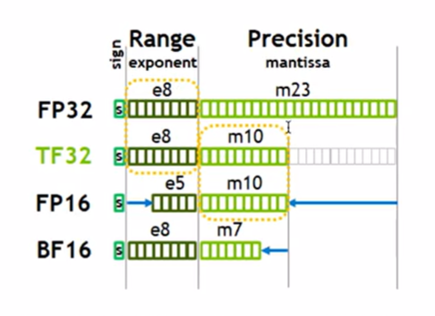
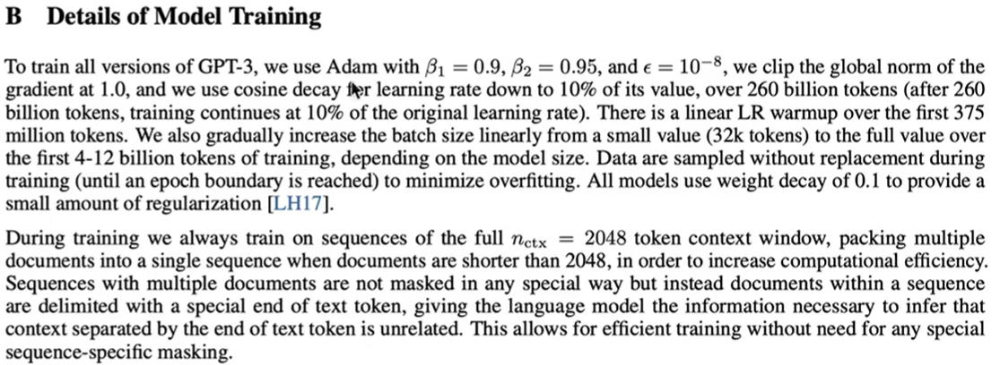

git init
git add .
git commit -m "[2401213398]
git remote add origin token/url
<!-- git pull --rebase origin master -->
git branch -M master
first: git push -u origin master; 
之后 git push 即可

git config --global -l
git remote -v


nn.Sequential 实现了 forward.
nn.ModuleList([submodel() for _ in range()])
nn.ModuleDict 可以索引访问

124M: n_layers = 12, dim = 768 
最大长度1024. 
position_embedding 完全随机初始也能得到不错结果。
GPT2 的残差连接使得梯度更直接的backpropagate到input. 
attention最后还有一个 ouput_proj
用哪个 tokenizer? tiktoken. 
如何像pipeline一样得到 num_return_sequence ??

nn.LayerNorm：在 hidden_dim 上操作归一, 因此参数为n_embd.

@classmethod: 类方法，可在不创建实例的前提下调用。model = GPT.from_pretrained(type)

self.apply(self._init_weights)

随机初始化权重，loss 接近 -ln(1/vocab_size) = 11

sd_hf["lm_head.weight"].data_ptr() == sd_hf["transformer.wte.weight"].data_ptr()
wte 和 lm_head 参数复用。。 原理不太懂。



TF32比FP32快. torch.set_float32_matmul_precision('high')

使用 BF16:
with autocast(device_type='cuda', dtype=torch.bfloat16):
    output = model(input)
    loss = loss_fn(output, target)

model = torch.compile(model)
no python interpreter needed, and GPU read/write speedup. compiler 做了很多优化.
initization needs 40s on my single 4090.

fix ugly number: vocab_size = 50257 -> 50304

hyperparameters in GPT3 paper:
Adam: betas=(0.9, 0.95), eps=1e-8

norm = torch.nn.utils.clip_grad_norm_(model.parameters(), 1.0) 
插入在 loss.backward() 之后
限制梯度的范数(L2范数)大小, 防止梯度爆炸



para 2: merge seqs into a whole seq, add a <|endoftext|> to the end of every single seq.

grad_accum_steps: 一个batchsize 需要 B*T = 0.5M tokens. GPU不够,那就拆成多次累加.


DisturbDataParallel: ddp, 多个GPU上运行同一个py script, 区别是 os.environ['RANK']
WORLD_SIZE 是总节点(GPU)数

DDP launch for multiple GPUs: 
torchrun --standalone -nproc_per_node main.py

DDP container automatically synchronizing and averging the gradients in backward process across all ranks of GPUs.

```py
if ddp: # every GPU only share its gradients at the last micro_step
    model.require_backward_grad_sync = (micro_step == grad_accum_steps - 1) 
loss.backward() # accmulate losses
```
上述代码不需要loss累加. 之前的多次loss没有share, 但只share一次即可。

pretrained OpenDatasets:
Slim_pajama、 FindWeb

Hellaswag validation. 补全句子多选题. smoooth, early signal
简单的模型还没有 in-context learning能力, 需要计算下每种答案的logits, 取概率最大的.
实际上选使得 avg loss 最小的。 

huggingface 缓存: ~/.cache/huggingface/hub


lora 需要添加的东西：
model = convert_linear_layer_to_lora(model, args) # 将线性层添加 lora
model = only_optimize_lora_parameters(model) # 只 optimize lora 参数
保存到 lora_load_path, 加载时也从 lora_load_path 加载.
load: 
save: get_lora_state_dict()

加载本地预训练模型, 路径提供到folder !! 自动识别加载 model.safetensors 等 (全参数微调)
--model_name_or_path 
加载lora.pt时， 改lora_load_path，model_name_or_path 还是 gpt2


transformers.pytorch_utils.Conv1D 就是 nn.Liner 的 weight转置。

--lora_module_name (part_module_name) h.  : 增加lora的模块


num decayed parameter tensors: 50, with 124,319,232 parameters
num non-decayed parameter tensors: 98, with 121,344 parameters


model.named_modules() 返回所有nn.Module子模块。 细化到Linear
model.named_parameters() 返回 所有(name, param)对。细化到 Linear中的weight + bias

```
    def forward(self, input): # (16, 139, 768)
        # torch.cuda.synchronize()
        # start_time = time.time()
        res = F.linear(input, self.weight.t(), bias=self.bias)
        lora_term = (input @ self.lora_right_weight) @ self.lora_left_weight * self.lora_scaling
        res += self.bias
        # torch.cuda.synchronize()
        # mid_time = time.time()
        res = input @ self.weight.t() + lora_term + self.bias
        # torch.cuda.synchronize()
        # end_time = time.time()
        # global time1, time2, cnt
        # cnt += 1
        # time1 += mid_time - start_time
        # time2 += end_time - mid_time
        # if cnt % 1000 == 0: # 原参数冻结: 0.75; 不冻结: 0.67
        #     print(f"{time1:.3f} / {time2:.3f} = {time1/time2:.3f}")
        return res
```

参数更新公式：$ w -= \alpha * \frac{\partial Loss}{\partial w} $

就如果按这样计算： (w+BA)*x，和 wx + B(Ax)相比
前者计算复杂度是BA + w*x， 后者是 wx + B(Ax)
$ in*out*rk :  bt*in*rk + bt*out*rk $

时间： 主干(+lora)前向, back

$\partial x = w, \partial w = x$
$\partial x = w + BA, \partial B = Ax, \partial A = Bx$

96个lora待更新参数. 每次GPT forward中, 48个lora_linear forward

train_data.json:  'train/eval' + '_' + 'steps/loss'

lora r32:
forward time per batch: 153.906 ms
backward time per batch: 245.607 ms
显存占用 22.73 G

(W+BA)x 
forward time: 132.220 ms
backward time: 237.112 ms
显存占用 22.69 G


lora rk1:
forward time per batch: 155.286 ms
backward time per batch: 244.342 ms
显存占用 23.20 G

lora rk8:
forward time per batch: 155.669 ms
backward time per batch: 243.581 ms
显存占用 21.85 G

lora rk16:
forward time per batch: 153.512 ms
backward time per batch: 244.973 ms
显存占用 21.77 G

lora rk64:
forward time per batch: 154.040 ms
backward time per batch: 251.082 ms
显存占用 20.60 G

full-param:
forward time per batch: 125.477 ms
backward time per batch: 272.275 ms
显存占用 23.50 G


总结:
LoRA 在小数据集上几乎不过拟合的关键在于：
冻结了大量模型参数，减少优化自由度。
低秩分解对新增参数施加了结构化约束。
预训练模型的强泛化能力得以保留。
参数更新规模小，类似于一种天然正则化。
设计适配迁移学习场景，更关注有效利用少量新数据。
因此，LoRA 微调的训练过程稳定且高效，尤其适合在小数据集上应用，同时避免了传统全参数微调中容易遇到的过拟合问题。


lora优势 (paper观点)：
LoRA can reduce the number of trainable parameters by 10,000 times and the
GPU memory requirement by 3 times

we do not need to calculate the gradients or maintain the optimizer states for most parameters.

unlike adapters, no additional inference latency


